# CosMx-Lite
Authors: Béibhinn O Hora, Roman Laddach, Jelmar Quist, Rosamund Nuamah, Anita Grigoriadis, Ciro Chiappini
Date: 15-Apr-2024


# Welcome

Nanostring’s CosMx Spatial Molecular Imager (SMI) presents researchers with extraordinary opportunities, allowing unparalleled insights into spatially resolved single-cell gene expression. Yet, amidst these promises lies a significant challenge: the complexity and scale of data generated by CosMx SMI experiments. 

Processing and analyzing such a wealth of information requires tailored computational tools and methodologies. Our practical guide, *Under the Hood of CosMx*, is designed to navigate you through the most efficient methods for analyzing CosMx SMI data, and to arm you with the knowledge and skills necessary to address the challenges posed by CosMx SMI data analysis. 

## Guide Highlights

Topics encompassed in this guide:

- An Introduction to Spatial Transcriptomics
- The General CosMx SMI Workflow
- Exporting Data from AtoMx, Nanostring's Spatial Informatics Platform
- Quality Control for CosMx SMI Data 
- Data Analysis and Visualisations


## Pre-requisites

A foundation in R programming is required. While this guide will provide information on how to analyse CosMx data, we will not be covering basics of R programming. 

We would recommend becoming familiar with: 

- Basic data structures
- Data manipulation with dplyr
- Data visualisation using ggplot2 
- Seurat: The analytical toolkit for single cell genomics

[R For Data Science](https://r4ds.had.co.nz) is a great resource for learning. There are also countless resources available online for learning basic R programming including data science blogs, and YouTube tutorials. The most effective way to learn is through hands-on practice, writing code, and learning from mistakes.

We would highly recommend reading the user guides for the AtoMx Spatial Informatics Platform (SIP) available on [Nanostring University](https://university.nanostring.com/page/document-library).

## Suggested Reading 

We would suggest reading the following articles for insights into spatial transcriptomic technologies and analysis with CosMx SMI: 

- He, S., Bhatt, R., Brown, C. et al. High-plex imaging of RNA and proteins at subcellular resolution in fixed tissue by spatial molecular imaging. Nat Biotechnol 40, 1794–1806 (2022). https://doi.org/10.1038/s41587-022-01483-z
- Rao, A., Barkley, D., França, G.S. et al. Exploring tissue architecture using spatial transcriptomics. Nature 596, 211–220 (2021). https://doi.org/10.1038/s41586-021-03634-9
- Wang Y, Liu B, Zhao G, Lee Y, Buzdin A, Mu X, Zhao J, Chen H, Li X. Spatial transcriptomics: Technologies, applications and experimental considerations. Genomics. 2023 Sep;115(5):110671. doi: 10.1016/j.ygeno.2023.110671. Epub 2023 Jun 21. PMID: 37353093; PMCID: PMC10571167.
- Zormpas E, Queen R, Comber A, Cockell SJ. Mapping the transcriptome: Realizing the full potential of spatial data analysis. Cell. 2023;186(26):5677-89.
- Yue L, Liu F, Hu J, Yang P, Wang Y, Dong J, et al. A guidebook of spatial transcriptomic technologies, data resources and analysis approaches. Computational and Structural Biotechnology Journal. 2023;21:940-55. 
- Garrido-Trigo, A., Corraliza, A.M., Veny, M. et al. Macrophage and neutrophil heterogeneity at single-cell spatial resolution in human inflammatory bowel disease. Nat Commun 14, 4506 (2023). https://doi.org/10.1038/s41467-023-40156-6


There are also several resources available on https://university.nanostring.com, which can help you further understand how CosMx SMI works - from laboratory procedures to data analysis considerations.


## On-going work and contributions

At the heart of this guide is a commitment to constant improvement. We strive to consistently enhance and broaden the scope of our guide, and welcome our readers to provide constructive feedback. If you're a spatial transcriptomics enthusiast, and wish to participate or share your insights, please reach out to us via our Github Repository ([link to be inserted]). Your input is highly valued.


# Background

## Transcriptomics

Every cell within the human body holds a captivating narrative, woven with intricate details about its unique identity, functions, and responses to the dynamic environment in which it resides. A pivotal chapter in the cell’s storybook revolves around the central dogma of molecular biology, as envisioned by Francis Crick in 1958. 

Within this chapter, we learn that information guiding the cell is stored in functional units known as genes within our DNA. Through transcriptional and translational processes, this vital information encoded in genes is used to make proteins. Acting as an intermediary product between genes and proteins, mRNA facilitates the transmission of this essential genetic information. 

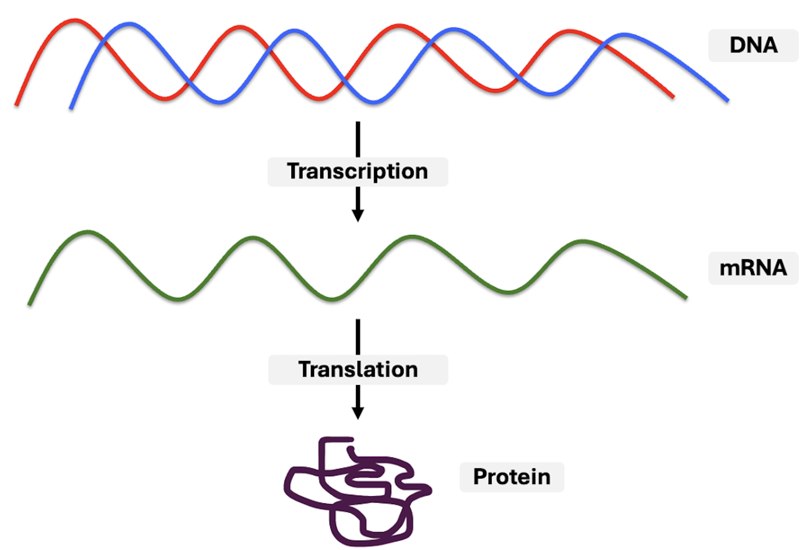


The study of RNA transcripts, **collectively termed the transcriptome**, provides a snapshot of all the genes that are actively being expressed in a cell or a group of cells at a given moment. This has uncovered a wealth of information about gene expression patterns, cellular processes, and the regulatory mechanisms that govern various biological systems. 

Consequently, **transcriptomics**, referring to the study of transcriptomes and their functions, has emerged as a focal point in research, driving significant technological advancements in the area. 


## Bulk, Single-cell and Spatial Transcriptomics

In the mid-2000s, the advent of **bulk RNA-sequencing** technologies enabled researchers to capture and analyse the collective gene expression profiles of entire cell populations. The growing interest in unravelling the intricate gene expression profiles of individual cells drove the development and widespread adoption of **single-cell RNA sequencing** around 2010. Technologies like Illumina Drop-seq and 10x Genomics' Chromium emerged, enabling the dissection of cellular heterogeneity, and offering insights into the unique transcriptomic profiles of individual cells. 

However, cell localization within tissue samples is completely lost using scRNA-seq, as the tissue is lysed during the scRNA-seq workflow. As researchers are always *hungry* for more detailed information, this set the stage for the emergence of spatially resolved transcriptomics. **Spatial transcriptomics** stands out by preserving the spatial organisation of regions or cells, providing invaluable insights into the diverse gene expressions across distinct areas of a tissue. This transformative field was first introduced in 2016 and recognised as Nature Method's Method of the Year in 2021. 

So, you may find yourself wondering, which technology is best suited for my analysis? How do I choose? The answer lies entirely in your research question and the specific insights you're seeking from your sample. Just as one navigates the diverse London property landscape with its array of options and features, researchers similarly navigate a complex technological terrain, carefully selecting the tool that aligns with their specific needs and objectives. 


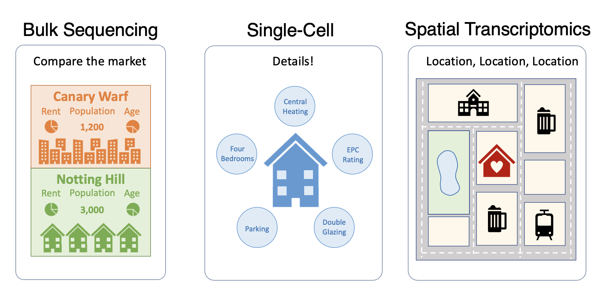


Bulk RNA sequencing can be like choosing a property based on overall neighborhood statistics. Just as you might analyze an entire neighborhood's average property value, the population size, or demographic composition, bulk RNA sequencing provides a global snapshot of gene expression in a sample. On the other hand, scRNA-seq involves inspecting each individual property in detail. Just as you might meticulously assess the characteristics of a specific house or apartment, scRNA-seq allows researchers to delve into the gene expression profiles of individual cells within a sample. This may allow for the identification of rare cell types or help in the understanding of heterogeneity within a cell population.

Spatial transcriptomics, the newest addition to the toolkit, can be like choosing a property based on its location within London. Just as the location of a property can significantly impact its value and potential, spatial transcriptomics allows researchers to visualize gene expression within the context of tissue or cellular architecture. This is particularly useful when studying the spatial organization of cells in a tissue, unravelling intricate interactions between neighbouring cells, and understanding the spatial distribution of specific gene expression patterns.

Ultimately, the choice between bulk, single-cell, or spatial transcriptomics depends on the specific nuances of your research question, much like selecting a property in London depends on your individual preferences, budget, and lifestyle. Are you interested in the overall trends of a biological system, the detailed characteristics of individual cells, or the spatial organization within a tissue? Tailoring your sequencing approach to the intricacies of your research will lead to the most insightful and relevant results, just as choosing the right property in London will provide you with a home that aligns with your needs and preferences.


## Spatial Transcriptomic Technologies 

Spatial transcriptomic technologies are a state of rapid evolution, marked by notable progress in experimental methodologies, improved image resolutions, expanded capabilities for handling larger tissue samples, increased coverage of RNA transcripts, and the continual development of analytical pipelines. 

These technologies can be categorised into three primary groups: 

1. **In Situ Hybridization (ISH): ** Profiles the transcriptome through the hybridization of complementary probes that bind to mRNA, enabling the subsequent reading of fluorescent labels for detection and analysis. Examples: MERFISH, CosMx SMI.
2. **In Situ Sequencing (ISS): ** Enable direct RNA sequencing within the tissue using padlock probes and the rolling-circle amplification (RCA) process. Examples: STARmap, HybISS, Xenium
3. **Next Generation Sequencing (NGS)**: Compartmentalizes tissue section and the entire transcriptome of each section is uniquely barcoded and sequenced. Examples: Visium, GeoMx


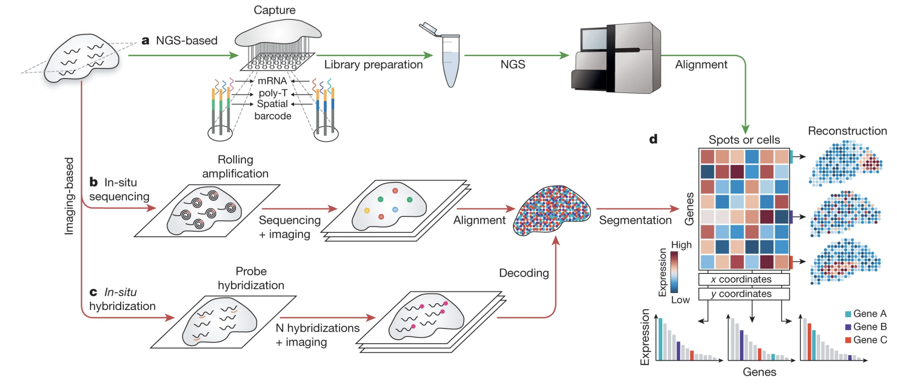


Each approach presents specific advantages and limitations, and are useful in addressing different research questions. Generally, NGS-based techniques are good for more exploratory analysis and hypothesis generation over a medium-to-large size tissue. In situ-based methods are better for investigating a smaller and more targeted gene-set in a tissue, at a much higher resolution. In the coming years, as these technologies further evolve, we would expect to see an increase in the number of genes available from in-situ-based methods and a higher resolution in NGS-based approaches. 

For this guide we will be focusing on the ISH-method from Nanostring's CosMx SMI. This technology facilitates swift quantification and visualization of a broad range RNA and protein analytes at both single-cell and subcellular resolutions. Importantly, it achieves this in intact Formalin-Fixed Paraffin-Embedded (FFPE) and Fresh-Frozen (FF) tissue samples. We will dissect how CosMx works in more detail in the next section.


## References 

*Marx, V. Method of the Year: spatially resolved transcriptomics. Nat Methods 18, 9–14 (2021). https://doi.org/10.1038/s41592-020-01033-y*

*Yue L, Liu F, Hu J, Yang P, Wang Y, Dong J, Shu W, Huang X, Wang S. A guidebook of spatial transcriptomic technologies, data resources and analysis approaches. Comput Struct Biotechnol J. 2023 Jan 16;21:940-955. doi: 10.1016/j.csbj.2023.01.016. PMID: 38213887; PMCID: PMC10781722.*

*Zormpas E, Queen R, Comber A, Cockell SJ. Mapping the transcriptome: Realizing the full potential of spatial data analysis. Cell. 2023;186(26):5677-89.*

*Rao, A., Barkley, D., França, G.S. et al. Exploring tissue architecture using spatial transcriptomics. Nature 596, 211–220 (2021). https://doi.org/10.1038/s41586-021-03634-9*


# CosMx SMI

## Overview

The CosMX SMI offers a high-plex in-situ based solution to spatial multiomics analysis. This technology allows for the rapid quantification and visualisation of RNA and protein analytes at cellular and subcellular resolution in both formalin-fixed paraffin-embedded (FFPE) and fresh frozen (FF) tissue samples. Since its launch, the number of RNA analytes available has grown from 1,000 to 6,000, indicating the exciting potential for achieving whole transcriptome analysis at single-cell resolution using CosMx SMI in the future. 

By leveraging CosMx SMI, individual cells can be identified in their natural environment within a tissue. This approach allows researchers to discern various cell types, understand their interactions, and unravel their functional significance, thereby enhancing our ability to interpret biological processes and disease mechanisms more effectively.

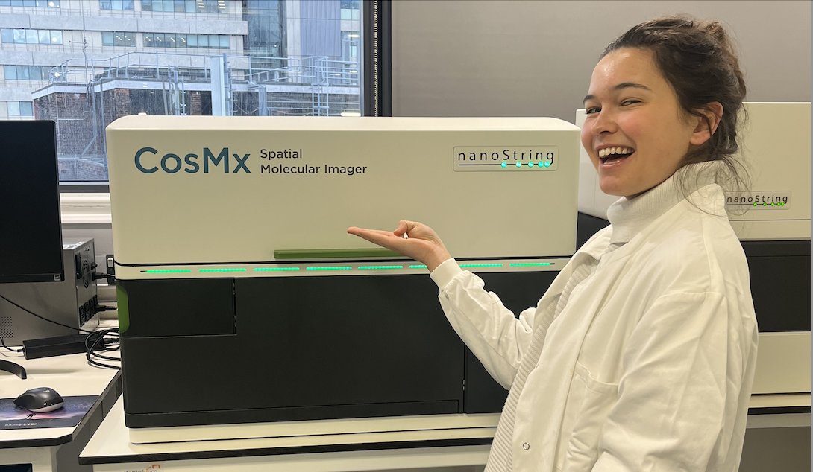


## Workflow 

CosMx SMI performs multiple cycles of nucleic acid hybridization with fluorescent molecular barcodes, enabling the precise measurement of RNAs and proteins. This approach extends traditional fluorescent in situ hybridization (FISH) chemistry but eliminates the requirements for tissue expansion, clearing, cDNA synthesis, or amplification. 

Furthermore, the SMI platform integrates fully automated fluidic systems with advanced imaging capabilities, streamlining the experimental workflow and enhancing precision in molecular analysis at the subcellular scale. Resulting data is exported to the cloud-based spatial informatics platform **AtoMx**, where interactive data analysis can be carried out.

More detailed information about the CosMx SMI chemistry and workflow can be found [here.](https://www.nature.com/articles/s41587-022-01483-z)


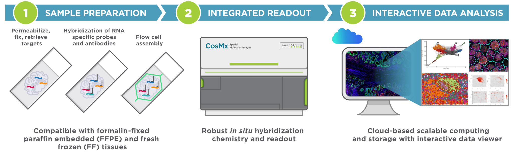


# AtoMx

## What is AtoMx?

Data generated from sample processing using CosMx SMI is stored on the AtoMx Spatial Informatics Platform (SIP), a cloud-based solution developed by NanoString and hosted on Amazon Web Services (AWS). Access to AtoMx SIP is facilitated through a web browser (Google Chrome works best!) using a secure login link provided by NanoString's identity provider, Okta. This allows users to securely access and manage their data within the platform using a standard web browser.
<br>


<br>

AtoMx SIP is designed to allow researchers **without** extensive coding experience to analyse and visualise their spatial multiomics data with the benefit of being all on one user-friendly platform. This eliminates a lot of data management concerns, as CosMx data can be analysed, stored and computed on the cloud as opposed to hosting analysis in-house or locally on a hard drive. 

AtoMx SIP offers a range of NanoString-configured modules and analysis pipelines tailored for processing data and deriving meaningful insights. On the [Nanostring University](https://university.nanostring.com/page/document-library) website, the AtoMx SIP user manual can be found. This contains more detailed instructions for accessing and navigating the AtoMx SIP, as well as information about the available modules can be found. *As AtoMx SIP is consistently evolving and improving, we would recommend to check for updates for the latest versions and manuals available. *

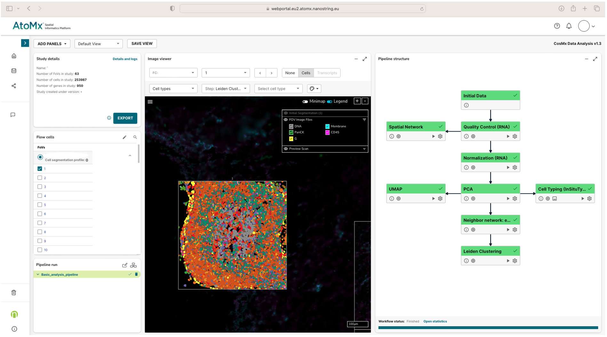

<br>

For researchers **with** coding expertise seeking to delve deeper into CosMx data analysis, AtoMx SIP provides the flexibility to construct custom analysis modules and pipelines. These customised modules and pipelines can also be executed within AtoMx, meaning users have the opportunity to independently create and input custom modules to carry out various functions or create visualisations of interest. Alternatively, users can collaborate with NanoString's support team for help to develop these customs modules. Examples of customised modules developed can be found on the GitHub of [Nanostring-Biostats.](https://github.com/Nanostring-Biostats/CosMxDACustomModules/tree/main).

However, for those aiming to have more control and flexibility over their data, exporting *relevant* data is a viable option and allows for a more extensive analysis, leveraging the broad range of analysis tools and packages available across programming languages for spatial data analytics. 


## Extracting images from AtoMx

The full flow cell image can be viewed from a study's image viewer panel. The export button within the download tab can be used to export the full flow cell image, with the choice of including grid lines, scale-bars, and FOV information. Within the image panel, users can also zoom in on different areas of the tissue. Segmentation details become visible when zoomed in to over ~100µm. <br>

<br>


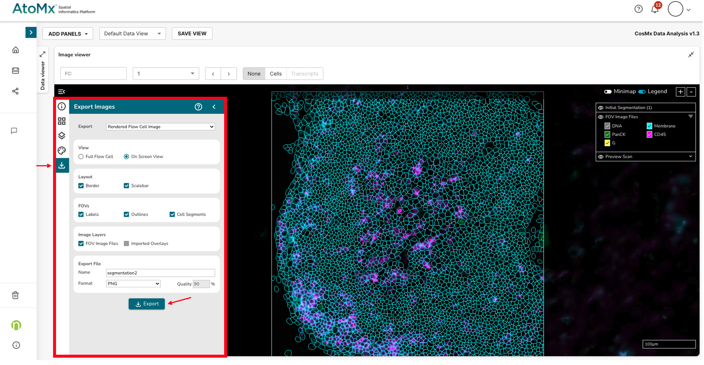


<br>

In addition, the intensity range of the fluorescent protein markers can be edited within the image viewer. We have found that this enhances cell visualisation, which is useful for assessing the quality of protein marker staining and cell segmentation. <br>
<br>


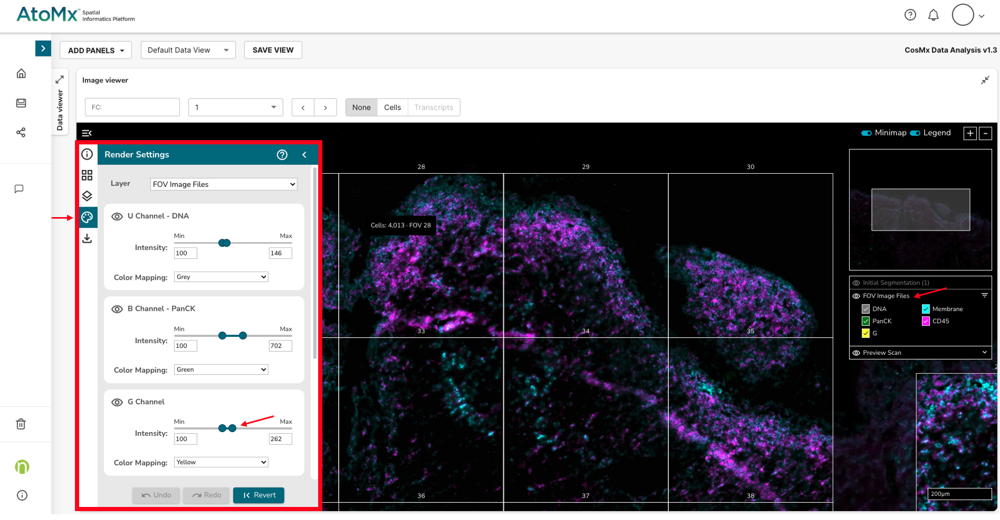

<br>

## Extracting data from AtoMx

There are two main options for exporting data from AtoMx: 
<br>

**1) Secure File Transfer Protocol (SFTP)** <br>

The main export function can be used to export to select and export relevant data via SFTP. Data can be accessed and downloaded using an STFP client tool such as FileZilla, or WinSCP. <br>

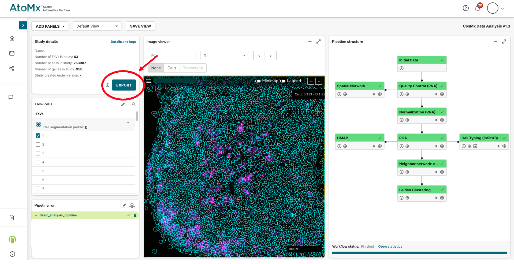
<br>
<br>

**2) AWS S3 Bucket**

Relevant data can be exported to an AWS S3 bucket by using a custom export function (e.g. the **flat file export module** or the **CosMx DA export module**) and including the path to the target AWS S3 bucket. The AWS Command Line Interface (CLI) tool can be used to quickly and easily access and download the data on the command line (for download to a HPC cluster for example). <br>


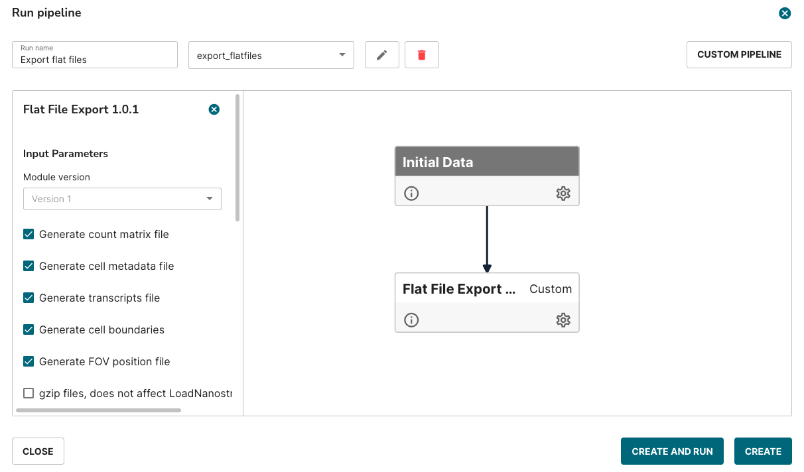
<br>

# Relevant data exports 

Different types of data formats can be exported from AtoMx using pre-defined and custom workflows. In this tutorial we focus on files required to perform analysis in Seurat and Squidpy called **flat files**. These files consist of tabular data. By using exclusively these files, we can avoid downloading large, unnecessary files and still achieve an effective analysis. <br>

## Images  
Four main image file types are available, which are currently necessary to create a data object in Squidpy but are not required for our modified Seurat workflow:

- CellComposite
- CellLabels
- CellOverlay
- CompartmentLabels

We suggest exploring the images within the CellOverlay folder, as they provide an overview of the cell mask and can assist in evaluating segmentation quality outside of AtoMx.   
<br>


<br>

## Flat files 

There are five different flat file exports available in AtoMx using the default export script. 

- exprMat_file.csv (**Expression matrix**)
- fov_postions_file.csv (**FOV positions**)
- metadata_file.csv (**Metadata**)
- polygons.csv (**Polygons**)
- tx_file.csv (**RNA transcripts**)


File names may contain a prefix associated with the study or export. For both pipelines, only three flat files are required: exprMat, fov_position and metadata. The remaining two can be ignored. 


**Useful tips** <br>
We recommend to use the option to compress files during export to .gz format to save on download time.
To easily export all files on Linux one can use `gunzip *` command within the directory containing compressed files.


## Flat files data structure and cleaning  

The number and types columns in the default export of flat files may vary depending on the pre-processing in AtoMx (e.g. creating Seurat object) and type of marker stains (e.g. staining for CD45 to help identify immune populations). Additionally, some reformatting may be required for squidpy.

### fov_position_file.csv
One of the three required files for the analysis. Very useful to grab an overview of the tissue locations and to help specify separate regions and/or tissues on the slide.
This contains information about:

- Slide – slide number it comes from
- FOV – filed of view
- X_mm/Y_mm – x/y coordinates of FOV positions in mm (previously in px)

### metadata_file.csv
Information in the metadata file can be grouped into main categories:

- the origin of the cell (fov, unique cell id)
- physical properties of the cell (area, aspect ratio, width, height)
- location of the cell centroid within each FOV (center X/Y local) and global position (center X/Y global)
- information about the protein staining (min/max intensity) - the type of protein my be specific to each experiment, but generally includes: DAPI, Membrane, PanCK, CD45
- other (e.g. Seurat information if that pipeline was used within AtoMx, some data quality information)

### expMat_file.csv
Expression matrix with raw counts of genes for each identified cell. Apart from the gene specific columns, additional columns include:

- the origin of the cell (fov, unique cell id)
- negative probes
- probes associated with the fiducial frame (SystemControl)

### Raw files preprocessing *(ASK ROMAN ABOUT THIS)
We recommend pre-processing the raw files to enhance the downstream analysis. Our suggestions are part of the 00_flat_file_preprocessing_v2.R script. Summary of the changes to the files:

- fov_positions_file.csv: updating the column name and adding the position of FOV in px
- exprMat_file.csv – removal of column containing SystemControl information, assigning rownames based on the unique cell ID, removal of columns not specific to gene expression (e.g. FOV)
- metadata_file.csv – selecting columns relevant to the downstream analysis and QC process, assigning rownames based on the unique cell ID,


### Summary of files 

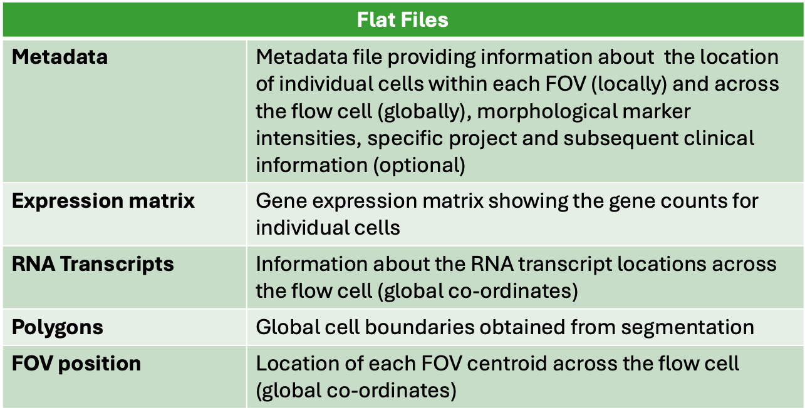

<br>


# CosMx_Lite 

In this guide, we introduce **CosMx_Lite**, an approach for analysing CosMx SMI data using flat file export available from the AtoMx SIP. Given the complexity and size of CosMx data outputs, our aim was to develop a lightweight and user-friendly method while retaining the necessary information required to gain meaningful biological insights from the data.

Several approaches have emerged for analysing spatial biology data such as Seurat, Squidpy, and Giotto, typically building on scRNA-seq analytical techniques. Following feedback from users at the [Spatial Biology Facility]( https://www.spatialbiologyfacility.co.uk/) at King’s College London, we selected the R programming language to use for this tutorial, as it is widely used among researchers accessing our service, particularly for analysing single-cell datasets using Seurat or carrying out analysis using the SingleCellExperiment object.

The knowledge and principles outlined in our guide may be applied to alternative tools, such as [Squidpy](https://squidpy.readthedocs.io/en/stable/#) and [Giotto](https://drieslab.github.io/Giotto_website/), although specific functions may vary and require adjustment. We have found that using tools in Python has very useful for carrying out functions that take advantage of machine learning, and for integrating spatial data with scRNA-seq data. We plan to expand our guide to include these in the future.

Each tool and language have their own advantages and limitations, but all can provide meaningful biological insights from CosMx SMI data to further our understanding of human health and disease, which is our primary goal as researchers.

In this guide, we expand on the default pipeline available with [Seurat](https://satijalab.org/seurat/) developed by the [Satija Lab](https://satijalab.org), a toolkit renowned for scRNA-seq analysis. Specific details on functions and spatial analytics approaches for CosMx SMI using Seurat can be found [here](https://satijalab.org/seurat/articles/seurat5_spatial_vignette_2). 

This broadened application is informed by our extensive experience working with CosMx SMI data across various tissue types alongside numerous research teams. Additionally, it reflects the valuable feedback received from our collaborators regarding their specific research inquiries and the insights they seek to extract from the data.

<br>


**References** <br>

Hao Y, Stuart T, Kowalski MH, Choudhary S, Hoffman P, Hartman A, Srivastava A, Molla G, Madad S, Fernandez-Granda C, Satija R. Dictionary learning for integrative, multimodal and scalable single-cell analysis. Nat Biotechnol. 2024 Feb;42(2):293-304. doi: 10.1038/s41587-023-01767-y. Epub 2023 May 25. PMID: 37231261; PMCID: PMC10928517.

Palla G, Spitzer H, Klein M, Fischer D, Schaar AC, Kuemmerle LB, Rybakov S, Ibarra IL, Holmberg O, Virshup I, Lotfollahi M, Richter S, Theis FJ. Squidpy: a scalable framework for spatial omics analysis. Nat Methods. 2022 Feb;19(2):171-178. doi: 10.1038/s41592-021-01358-2. Epub 2022 Jan 31. PMID: 35102346; PMCID: PMC8828470.

Dries R, Zhu Q, Dong R, Eng CL, Li H, Liu K, Fu Y, Zhao T, Sarkar A, Bao F, George RE, Pierson N, Cai L, Yuan GC. Giotto: a toolbox for integrative analysis and visualization of spatial expression data. Genome Biol. 2021 Mar 8;22(1):78. doi: 10.1186/s13059-021-02286-2. PMID: 33685491; PMCID: PMC7938609.


# Dataset

The data used in this tutorial is derived from a lymph node sample (FFPE) obtained from a treatment-naive patient diagnosed with Triple-Negative Breast Cancer (TNBC). 

Tissue was obtained through the King’s Health Partner’s Breast Cancer Tissue and Data Bank. Research ethics approval was obtained from the local research ethics committee (KHP Cancer Biobank REC ref 18/EE/0025).

Relevant files are available for download from our GitHub here.


# Pre-processing data 

## Setting up R enviroment 

Set up your environment to avoid unexpected errors.

```{r, results='hide'}
## Clean environment
rm(list = ls(all.names = TRUE)) 
gc()
options(max.print = .Machine$integer.max, scipen = 999, stringsAsFactors = F, dplyr.summarise.inform = F) 
```

```{r}
## Set seed for reproducibility
set.seed(1234)
```

```{r, results='hide',message=FALSE}
## Load libraries 
library("dplyr")
library("Seurat") # Version 5 
library("patchwork")
library("ggplot2")
```


## Reading in data 

### Field of View (FOV) positions

FOV positions contains information about FOV x/y coordinates:  
```{r}
fov_positions = read.csv("input/fov_positions_file.csv", header = TRUE)
head(fov_positions)
```

### Metadata

Metadata has information about:
- the origin of the cell (fov, unique cell id)
- physical properties of the cell (area, aspect ratio, width, height)
- location of the cell centroid within each FOV (center X/Y local) and global position (center X/Y global)
- information about the protein staining (min/max intensity) - the type of protein my be specific to each experiment

```{r}
metadata = read.csv("input/metadata_file.csv", header = TRUE)
head(metadata)
```

## Expression matrix

Expression matrix contains raw counts of gene expression per cell. It also includes information about the negative probes levels (`NegPrb`).   
```{r}
exprMat <- read.csv("input/exprMat_file.csv", header = TRUE)
exprMat[1:5,1:5]
```

## Pre-processing data

```{r} 
## Prepare fov_positions_file.csv 
colnames(fov_positions)[which(colnames(fov_positions)=="FOV")] = "fov" # all files use `fov` for FOVs
fov_positions$X_px = fov_positions$X_mm*1000/0.1202809 # converting mm to px 
fov_positions$Y_px = fov_positions$Y_mm*1000/0.1202809 # converting mm to px 

write.table(fov_positions, file = "fov_positions_file.csv", quote = TRUE, sep = ",", row.names = TRUE)
```

```{r}
## Prepare exprMat_file.csv
rownames(exprMat) = exprMat$cell # cell contains information about slide_fov_cell as a good unique identifier for cells
colnames(exprMat) = gsub("Negative", "NegPrb", fixed = TRUE, colnames(exprMat)) # changing the name 
exprMat = exprMat[,grep("SystemControl", colnames(exprMat), invert = TRUE)] # removing columns which contain SystemControl probes

exprMat$fov = NULL 
exprMat$cell_ID = NULL
exprMat$cell = NULL

write.table(exprMat, file = "exprMat_file.csv", quote = TRUE, sep = ",", row.names = TRUE)
```


## Cell number and order
It is critical to ensure that the metadata and the expression matrix contain the same number of cells and they follow the same order.

### Number of cells  
```{r}
nrow(metadata) == nrow(exprMat) # comparing the number of rows
```
If the number is not correct, it may be due to some FOVs being removed due at the export stage, which most commonly happens if the number of detected cells is 0.

### Order of cells  
```{r}
identical(rownames(metadata), rownames(exprMat)) # comparing the order based on the unique cell ID
```

If the number of cells is identical, but the order is not, a simple re-ordering should update it:
```{r}
exprMat = exprMat[rownames(metadata),]
identical(rownames(metadata), rownames(exprMat)) # comparing the order based on the unique cell ID
```

```{r}
# Saving metadata file
write.table(metadata, file = "metadata_file.csv", quote = TRUE, sep = ",", row.names = TRUE)
```


# Overview of data 

A script to investigate CosMx data using flat file exports. The script allows for:
- tissue/area annotation according to the FOV
- visualization of cell centroids across whole slide and subsections

This allows for the creation of Seurat object from expMat and metadata files only (without using the cell boundaries and tissue image). 

<insert section on creating seurat object>

## FOVs and separation into tissues  
The visualization shows which FOVs belong to which fragment of the tissue. 
```{r, fig.width = 4, fig.height = 6}
ggplot(fovPositions, aes(x=X_mm, y=Y_mm, label=fov)) + 
  geom_point(size=4, colour="red", alpha=0.3, shape=15) + 
  theme_minimal() + 
  geom_text(size=3) +
  ggtitle("FOV position")
```

Only certain FOVs will be used for the tutorial/analysis due to a high number of cells.  
- area_01 - upper left corner FOV15-18 + FOV24-44
- area_02 - upper/middle right FOV8-13 + FOV45-61 (without 57)
- area_03 - remaining FOVs

```{r, fig.width = 4, fig.height = 6}
fovPositions = fovPositions %>% mutate(region = case_when(
  fov %in% c(15:18, 24:44) ~ "area_01",
  fov %in% c(8:13, 45:56, 58:61) ~ "area_02",
  fov %in% c(1:7, 14, 19:23, 57, 62:63) ~ "area_03"
))

ggplot(fovPositions, aes(x=X_mm, y=Y_mm, label=fov, colour=region)) + 
  geom_point(size=4, alpha=0.3, shape=15) + 
  theme_minimal() + 
  geom_text(size=3, colour="black") +
  ggtitle("FOV position")
```

Adding this information to metadata, as this will be used for Seurat object creation.  
```{r, fig.width = 6, fig.height = 6}
metadata = metadata %>% mutate(region = case_when(
  fov %in% c(15:18, 24:44) ~ "area_01",
  fov %in% c(8:13, 45:56, 58:61) ~ "area_02",
  fov %in% c(1:7, 14, 19:23, 57, 62:63) ~ "area_03"
))

ggplot(metadata, aes(x=CenterX_global_px, y=CenterY_global_px, colour=region)) + 
  geom_point(size=0.1) + theme_minimal()
```

Saving updated files in RDS format.
```{r}
saveRDS(expMat, "../input/GEX_only_genes_and_NegPrb_for_Seurat.RDS")
saveRDS(metadata, "../input/metadata_for_Seurat.RDS")
```


# Quality Control


# The Spatial Biology Facility

## About us 


## Services we offer

## Contact us

## Licence for E-Book

MIT?


```{r}
sessionInfo()
```


```{r eval=FALSE}
bookdown::serve_book()
```


```{r include=FALSE}
# automatically create a bib database for R packages
knitr::write_bib(c(
  .packages(), 'bookdown', 'knitr', 'rmarkdown'
), 'packages.bib')
```


